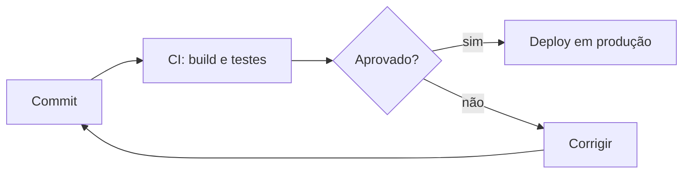
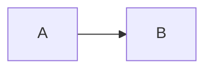

import Tabs from '@theme/Tabs';
import TabItem from '@theme/TabItem';

Referência rápida de tudo o que pode ser usado ao escrever uma página. Copie o trecho de código
ao lado de cada exemplo. Um modelo de página completo está em
[`frontend/templates/doc-template.mdx`](https://github.com/elizfab/portal-dev/blob/main/frontend/templates/doc-template.mdx).

## Front matter

Todo arquivo `.mdx` começa com metadados:

```yaml title="docs/categoria/topico.mdx"
---
title: Terraform            # título da página e da aba
sidebar_label: Terraform    # (opcional) rótulo na barra lateral
sidebar_position: 3         # ordem dentro da categoria
description: Resumo curto   # usado em SEO e nos cards
---
```

## Alertas (admonitions)

Cada tipo de alerta tem uma cor própria da paleta:

:::note[Nota · roxo]
Informação complementar, sem urgência.
:::

:::tip[Dica · verde]
Atalhos, boas práticas e recomendações.
:::

:::info[Info · azul]
Contexto ou explicação adicional.
:::

:::warning[Atenção · laranja]
Algo que pode causar problemas se ignorado.
:::

:::danger[Perigo · vermelho]
Ações destrutivas ou irreversíveis, como `rm -rf` ou `terraform destroy`.
:::

```md
:::tip[Título opcional]
Conteúdo do alerta.
:::
```

## Blocos de código

### Com título, numeração e destaque

```bash title="deploy.sh" showLineNumbers
#!/usr/bin/env bash
set -euo pipefail
# highlight-next-line
npm run build
# success-next-line
echo "Build concluído"
# error-next-line
rm -rf /  # nunca faça isso
```

Comentários mágicos disponíveis:

| Comentário | Efeito |
| --- | --- |
| `// highlight-next-line` / `highlight-start` … `highlight-end` | <span className="text--orange">destaque laranja</span> |
| `// success-next-line` / `success-start` … `success-end` | <span className="text--green">linha correta (verde)</span> |
| `// error-next-line` / `error-start` … `error-end` | <span className="text--red">linha incorreta (vermelho)</span> |

Também é possível destacar linhas pelo número: ` ```js {2,4-5} `.

### Comparação (diff)

```diff
- const url = "http://api.exemplo.com";
+ const url = process.env.API_URL;
```

### Linguagens suportadas

`bash`, `powershell`, `batch`, `docker`, `hcl` (Terraform), `yaml`, `json`, `java`, `go`, `python`,
`sql`, `groovy` (Jenkinsfile), `ini`, `toml`, `nginx`, `diff`, `ruby`, além das padrão
(`js`, `ts`, `jsx`, `tsx`, `css`, `html`, `markdown`…).

```hcl title="main.tf"
resource "aws_s3_bucket" "site" {
  bucket = "portal-dev-site"

  tags = {
    Projeto = "portal-dev"
  }
}
```

## Abas (Tabs)

Ideal para separar instruções por sistema operacional ou gerenciador de pacotes.
`groupId` sincroniza a escolha entre todas as abas da página e a lembra entre visitas.

<Tabs groupId="os">
  <TabItem value="linux" label="Linux" default>

  ```bash
  sudo apt install -y git
  ```

  </TabItem>
  <TabItem value="macos" label="macOS">

  ```bash
  brew install git
  ```

  </TabItem>
  <TabItem value="windows" label="Windows">

  ```powershell
  winget install --id Git.Git -e
  ```

  </TabItem>
</Tabs>

## Diagramas (Mermaid)



````md

````

## Badges

<Badge color="orange">laranja</Badge> <Badge color="pink">rosa</Badge> <Badge color="red">vermelho</Badge>{' '}
<Badge color="purple">roxo</Badge> <Badge color="green">verde</Badge> <Badge color="blue">azul</Badge>{' '}
<Badge color="cyan">ciano</Badge> <Badge color="gray">cinza</Badge>

```jsx
<Badge color="green">completo</Badge>
```

## Ícones de tecnologia

Qualquer ícone do [Devicon](https://devicon.dev/):

<TechIcon icon="kubernetes/kubernetes-original" alt="Kubernetes" size={56} />

```jsx
<TechIcon icon="kubernetes/kubernetes-original" alt="Kubernetes" />
```

## Atalhos de teclado

Pressione <kbd>Ctrl</kbd> + <kbd>Shift</kbd> + <kbd>P</kbd> para abrir a paleta de comandos.

## Detalhes recolhíveis

<details>
  <summary>Ver saída completa do comando</summary>

```text
NAME                     READY   STATUS    RESTARTS   AGE
minha-app-7d9c8b-x2k4p   1/1     Running   0          3d
```

</details>

## Tabelas

| Comando | Descrição | Nível |
| --- | --- | --- |
| `git status` | Mostra o estado da árvore de trabalho | <Badge color="green">básico</Badge> |
| `git rebase -i` | Reescreve o histórico | <Badge color="orange">intermediário</Badge> |
| `git reflog` | Recupera commits perdidos | <Badge color="red">avançado</Badge> |

## Cores de texto

<span className="text--orange">laranja</span> · <span className="text--pink">rosa</span> ·{' '}
<span className="text--red">vermelho</span> · <span className="text--purple">roxo</span> ·{' '}
<span className="text--green">verde</span> · <span className="text--blue">azul</span> ·{' '}
<span className="text--cyan">ciano</span>

```jsx
<span className="text--purple">texto roxo</span>
```

## Listas de tarefas

- [x] Criar a estrutura
- [ ] Escrever o conteúdo
- [ ] Revisar

## Lista de páginas da categoria

Em páginas `index.mdx` de categoria, use `<DocCardList />` para listar automaticamente as subpáginas como cards.
