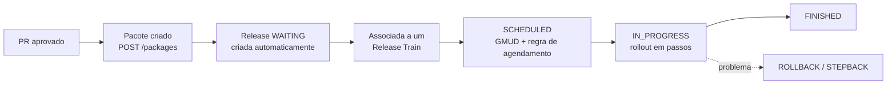

<Badge color="green">visão geral</Badge>

## Fluxo ponta a ponta

## Etapas

### 1. Empacotamento

O pipeline de CI publica um **pacote** (commit, PR, story). Se a aplicação ainda não existir, ela é
**cadastrada automaticamente** a partir do nome e da URL do PR.

### 2. Criação da release

Junto com o pacote nasce uma **release** com status `WAITING`, vinculada a um agendamento e a uma data.

### 3. Embarque no trem

Diariamente um job cria os **release trains** do dia (respeitando [bloqueios](../03-release-train/02-bloqueios.mdx))
e, no horário de corte, associa as releases `WAITING` daquele dia ao trem.

### 4. Agendamento e mudança

Para cada release associada é aberta a **GMUD** e criada uma regra de disparo para o horário da release.
O status passa a `SCHEDULED`.

### 5. Rollout

A release entra em `IN_PROGRESS` e é exposta conforme a [estratégia escolhida](../02-estrategias-de-rollout/index.mdx).
O Release Manager pode pausar, retomar, fazer stepback ou rollback.

### 6. Encerramento

O resultado do rollout é registrado (`rollout-result`). Quando **todas** as releases do trem chegam a um
status terminal, o trem é finalizado automaticamente (**auto-finish**).

:::tip
Todo passo gera um registro no **histórico de status**, que é a base para auditoria.
Veja [Histórico e auditoria](../04-operacao/05-historico-e-auditoria.mdx).
:::
