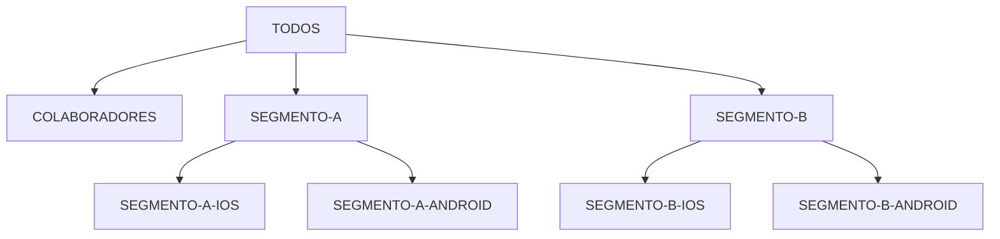

<Badge color="orange">entidade</Badge>

:::info[Definição]
**Audiência** é o público que recebe a release: uma plataforma, um segmento de clientes,
colaboradores internos ou todos.
:::

## Hierarquia

Audiências podem ter um **pai** (`parentId`), formando uma árvore:

`GET /audiences/by-parent/{parentId}` lista os filhos de um nó.

## Padrões de nome

- `UPPERCASE` com hífen separando segmento e plataforma: `SEGMENTO-PLATAFORMA`.
- Uma audiência geral (`EVERYONE`/`TODOS`) representa 100% do público.
- As audiências padrão são criadas por **seed** na inicialização do serviço.

## Uso no rollout

- Na resposta da API, a release traz `audiences` como **lista de nomes**, não de IDs.
- Começar por **colaboradores** (dogfooding) e só depois expor clientes é a forma mais simples de rollout seguro.
- No [score gradual](../02-estrategias-de-rollout/04-score-gradual.mdx) as audiências viram **faixas de score**.
