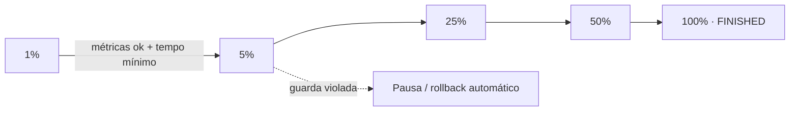

<Badge color="green">automático</Badge>

:::info[Definição]
No **rollout progressivo** a versão é exposta em **passos percentuais pré-definidos**, e o avanço acontece
**automaticamente** enquanto as métricas de saúde estiverem dentro dos limites.
:::

## Como funciona

### Passos

Uma sequência típica é `1% → 5% → 25% → 50% → 100%`. Cada passo tem:

- **tempo mínimo** de permanência (ex.: 30 min);
- **volume mínimo** de sessões para que a decisão seja estatisticamente útil;
- **métricas de guarda** que precisam estar saudáveis.

### Critérios de avanço

O sistema avança quando **todas** as condições são verdadeiras: tempo mínimo cumprido, volume mínimo
atingido, métricas dentro do limite e horário dentro da janela operacional.

### Reversão automática

Se uma métrica de guarda passar do limite por um período (ex.: erro acima de 0,5% por 10 min),
a expansão é **pausada** ou **revertida** automaticamente. Veja [Saúde e controles](../04-operacao/04-saude-e-controles.mdx).

## Quando usar

- Times com **boa observabilidade** e deploys frequentes.
- Mudanças de baixo/médio risco em que a velocidade importa.

## Cuidados

:::warning
Percentual baixo com pouco tráfego não diz nada. Defina um **volume mínimo** por passo, senão a
automação avança com base em ruído.
:::
