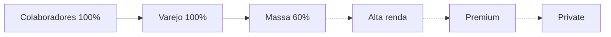

<Badge color="pink">segmentado</Badge>

:::info[Definição]
No **score gradual** cada cliente tem um **score de 0 a 100** e a novidade é liberada por **faixas**:
**quanto menor o score, mais cedo o cliente vê a novidade**. Os primeiros são públicos tolerantes a risco
(colaboradores), e os últimos são os segmentos mais sensíveis.
:::

## Régua de score

A régua divide o público em segmentos contíguos. Exemplo:

| Segmento | Faixa de score | Perfil |
| --- | --- | --- |
| Colaboradores | 0–10 | Público interno (dogfooding) |
| Varejo | 11–30 | Grande volume, perfil padrão |
| Massa | 31–50 | Base ampla |
| Alta renda | 51–70 | Mais sensível |
| Premium | 71–90 | Atendimento diferenciado |
| Private | 91–100 | Máxima sensibilidade |

O ponteiro **"liberado até aqui"** indica o maior score já exposto (ex.: `score ≤ 38`). Clientes acima dele
continuam na versão estável.

## Progressão por segmento

Cada segmento avança em **passos** próprios. O painel mostra:

| Coluna | Significado |
| --- | --- |
| **Passo atual** | Percentual liberado dentro do segmento (ex.: 30%) |
| **% liberado** | Barra de progresso do segmento |
| **Status** | Aguardando, Em progresso, Concluído, Pausado |
| **Saúde** | Saudável, Atenção ou Crítico, a partir das métricas de guarda |
| **Próximo passo** | Próximo percentual e horário previsto (ex.: 40% às 11h30) |
| **Ações** | Iniciar, Avançar, Pausar |

## Indicadores do painel

- **% liberado (geral)**: fração do público total já exposta, com meta e horário (ex.: 100% até 18h30).
- **Clientes expostos**: número absoluto sobre o total elegível.
- **Saúde da jornada**: estado consolidado (erros, crash).
- **Grupo de controle**: percentual mantido fora (holdout) para comparação.

## Saúde e controles

| Controle | Exemplo |
| --- | --- |
| Métrica de guarda: taxa de erro JS | menor que 0,5% |
| Crash da webview | menor que 0,2% |
| Latência da tela | menor que 2,0 s |
| Volume mínimo para avançar | 50 mil sessões por passo |
| Auto-rollback | pausar automaticamente se erro maior que 0,5% por 10 min |
| Janela operacional | 08:00–18:30 |
| Versões | hash da nova versão e hash da versão estável |

## Histórico de ações (auditoria do ramp)

Cada evento entra numa linha do tempo, com autor, tipo e horário:

- *Rollout iniciado: feature ativada*, por uma pessoa, com **aprovação 4-eyes**;
- *Colaboradores concluído (100%)*, **automático**;
- *Varejo concluído (100%)*, automático por **regra de progressão**;
- *Massa avançado 25% → 30%*, **manual**, com o identificador do operador.

## Ações globais

- **Avançar próximo passo**: avança o segmento em progresso.
- **Pausar tudo**: congela todos os segmentos.
- **Ver no observability**: atalho para os dashboards de métricas (ex.: Datadog).

:::tip[Por que score e não só percentual?]
Percentual aleatório espalha o risco por **todos** os perfis. Por score, o risco fica **concentrado em quem
tolera mais**, e os segmentos sensíveis só recebem a versão depois de ela já ter sido validada por milhões de sessões.
:::
