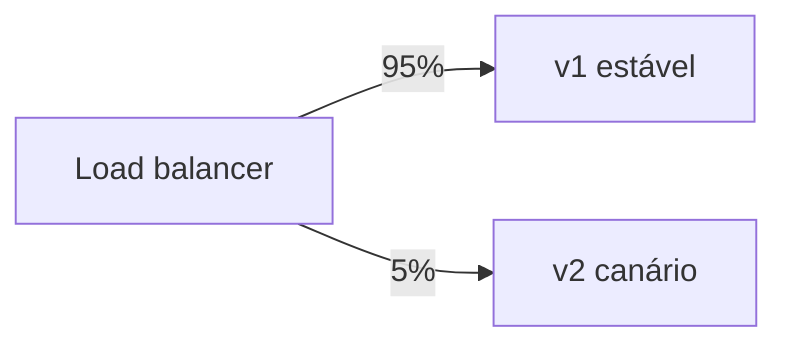

<Badge color="cyan">relacionado</Badge>

## Canary release

Uma fração pequena do **tráfego** vai para a nova versão (as "instâncias canário") enquanto o restante
continua na versão estável. Se as métricas piorarem, o tráfego volta para a estável.

## Blue-green

Dois ambientes idênticos: **blue** (atual) e **green** (novo). O deploy vai para o green e, validado, o tráfego
é **trocado de uma vez**. O rollback é trocar de volta.

| | Canary | Blue-green |
| --- | --- | --- |
| Exposição | Gradual | Tudo de uma vez |
| Custo de infra | Baixo | Ambiente duplicado |
| Rollback | Redirecionar tráfego | Trocar ambiente |

## Feature flags

A funcionalidade fica no código, mas **desligada**, e é ligada por configuração, por usuário, segmento ou percentual.

- Separa **deploy** (código em produção) de **release** (funcionalidade visível).
- Permite [score gradual](./04-score-gradual.mdx) e [rollout progressivo](./01-rollout-progressivo.mdx)
  sem novo deploy.
- Kill switch: desligar a flag é o rollback mais rápido que existe.

:::warning
Flags acumuladas viram dívida técnica. Remova a flag e o código morto quando o rollout chegar a 100%.
:::

## Dark launch

A versão nova roda em produção **sem o usuário ver** (ex.: processa requisições em paralelo e descarta a resposta)
para medir desempenho antes do lançamento.
