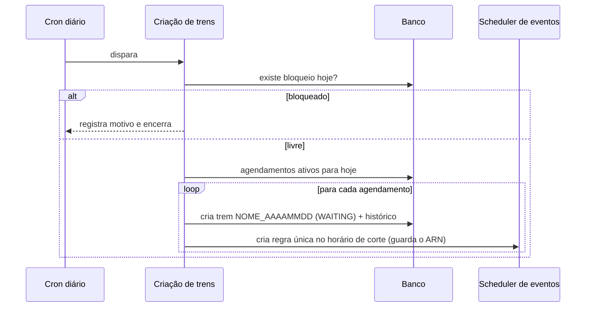

<Badge color="purple">eventos</Badge>

Os trens não são criados à mão: dois fluxos orientados a eventos (ex.: AWS EventBridge + Lambda) cuidam disso.

## Fluxo 1: criação dos trens

Disparado por um **cron diário**, sem endpoint HTTP.

## Fluxo 2: associação das releases

Disparado pela regra criada no fluxo 1 (evento `RELEASE_TRAIN_ASSOCIATION`).

1. Busca o trem do evento.
2. Busca as releases `WAITING` do dia e daquele agendamento.
3. **Nenhuma release** → o trem é **cancelado**.
4. Para cada release:
   1. associa o trem;
   2. abre a **GMUD** (serviço externo) e salva o número;
   3. cria a regra de disparo no horário da release e salva o **ARN** (para cancelar depois);
   4. muda para `SCHEDULED` e grava histórico.

## Roteamento de eventos

Uma única função recebe os eventos e decide pelo tipo:

| `eventType` | Destino |
| --- | --- |
| `RELEASE_TRAIN_ASSOCIATION` | Associação de releases |
| (padrão) | Criação de trens |

:::tip
Guardar o **ARN** de cada regra criada é o que permite cancelar ou reagendar sem deixar disparos órfãos.
:::
