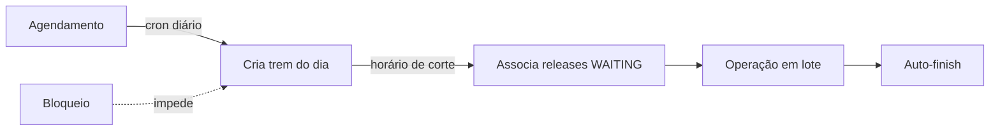

O conceito está em [Fundamentos → Release Train](../01-fundamentos/04-release-train.mdx). Esta seção detalha a
**mecânica**: de onde os trens vêm, quando não rodam e como são operados.

<DocCardList />
