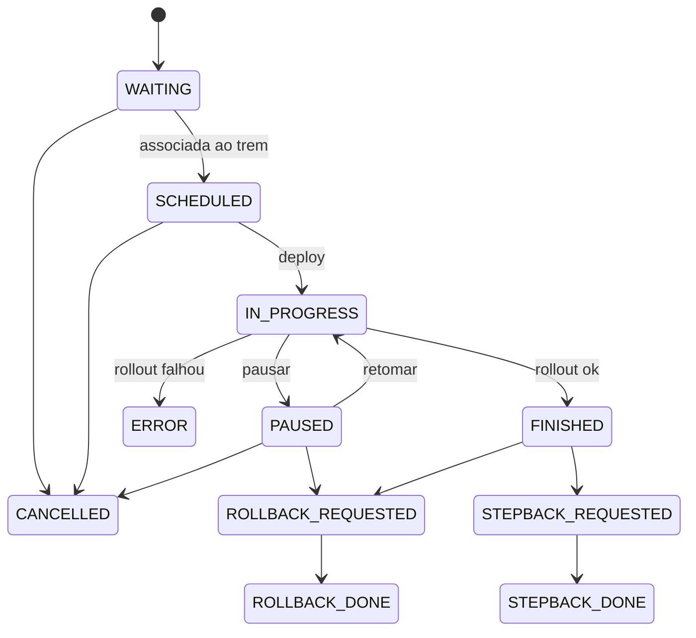

<Badge color="blue">referência</Badge>

## Status da release

| Status | Significado |
| --- | --- |
| `WAITING` | Aguardando embarque em um trem |
| `SCHEDULED` | Associada ao trem, GMUD aberta, disparo agendado |
| `IN_PROGRESS` | Rollout em execução |
| `PAUSED` | Expansão pausada |
| `STEPBACK_REQUESTED` → `STEPBACK_DONE` | Retrocesso solicitado → concluído |
| `ROLLBACK_REQUESTED` → `ROLLBACK_DONE` | Reversão solicitada → concluída |
| `FINISHED` | Concluída com sucesso (100%) |
| `CANCELLED` | Cancelada |
| `ERROR` | Falha no rollout (detalhes na observação) |

## Status do release train

| Status | Significado |
| --- | --- |
| `WAITING` | Criado, aguardando |
| `IN_PROGRESS` | Em andamento |
| `PAUSED` | Pausado |
| `STEPPED_BACK` | Retrocedido |
| `CANCELLED` | Cancelado |
| `FINISHED` | Todas as releases terminaram |

## Estados terminais

`FINISHED`, `ROLLBACK_DONE`, `STEPBACK_DONE`, `CANCELLED` e `ERROR`. Quando todas as releases de um trem
estão em um deles, o trem é finalizado automaticamente.

## Diagrama

## Convenções

- Valores em `UPPERCASE_WITH_UNDERSCORES`, criados por **seed** na inicialização.
- A API retorna o **nome** do status, nunca o UUID.
