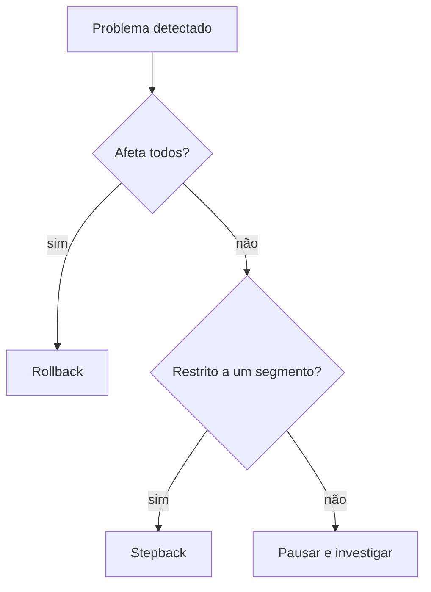

<Badge color="red">reversão</Badge>

| | Stepback | Rollback |
| --- | --- | --- |
| **O que faz** | Volta a release para a **audiência/passo anterior** | Reverte **totalmente** para o pacote estável |
| **Alcance** | Parcial | Total |
| **Pacote atual** | Continua válido | Fica **bloqueado** |
| **Quando** | Problema restrito a um segmento ou plataforma | Problema grave ou generalizado |
| **Status** | `STEPBACK_REQUESTED` → `STEPBACK_DONE` | `ROLLBACK_REQUESTED` → `ROLLBACK_DONE` |
| **Disponível em** | Expansão concluída | Expansão pausada ou concluída |

## Como decidir

:::danger
Rollback bloqueia o pacote. Para liberar a correção é preciso gerar um **novo pacote** (novo commit).
:::

:::tip
Na dúvida, **pause primeiro**. Pausar não reverte nada e dá tempo para analisar as métricas.
:::
