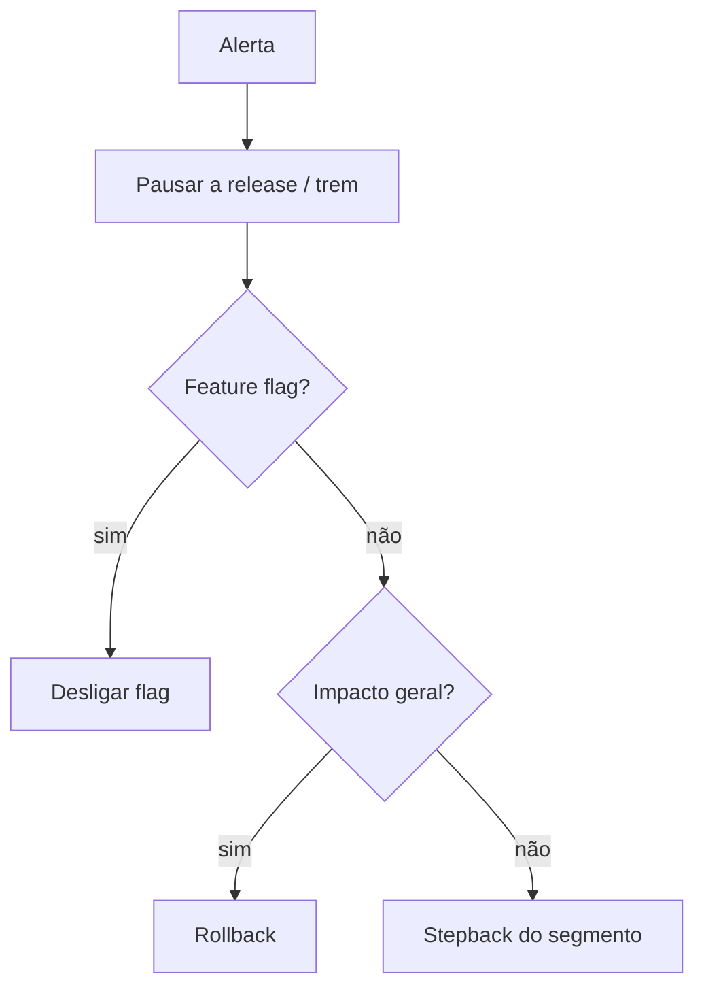

<Badge color="red">incidente</Badge>

## 1. Detectar

Sinais: alerta de métrica de guarda, aumento de erros/crash, chamados de atendimento, auto-pause disparado.

## 2. Conter (primeiros 5 minutos)



:::danger[Regra de ouro]
**Conter antes de investigar.** Pausar é sempre seguro e reversível.
:::

## 3. Comunicar

| Para quem | O quê | Quando |
| --- | --- | --- |
| Time responsável pela aplicação | Release afetada, métrica, ação tomada | Imediatamente |
| Atendimento / negócio | Impacto percebido pelo cliente e previsão | Até 15 min |
| Gestão de mudança | Atualização da GMUD | Após a contenção |

Modelo de mensagem:

```text
[INCIDENTE] Release <aplicação> v<versão> · <segmento/percentual>
Sintoma: <métrica> em <valor> (limite <limite>)
Ação: <pausa | stepback | rollback> às <hora>
Status: <em investigação | contido | resolvido>
Próxima atualização: <hora>
```

## 4. Corrigir

Correção via [fluxo de hotfix](../07-processo/04-hotfix.mdx). O pacote revertido permanece bloqueado.

## 5. Encerrar

- Registrar o resultado (`rollout-result` com `success: false` e erros na observação, quando aplicável).
- Atualizar a GMUD.
- **Pós-mortem sem culpados**: linha do tempo (use o histórico de status), causa raiz, o que detectou, ações preventivas.
