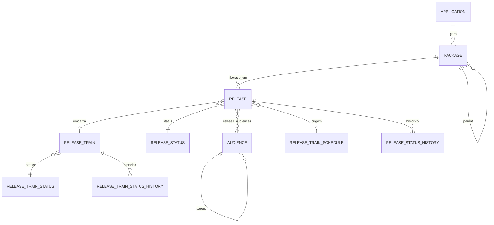

<Badge color="purple">dados</Badge>

## Diagrama ER

`RELEASE_TRAIN_BLOCK` é independente: afeta trens e releases pela **data**.

## Entidades

### Application
`id`, `repositoryName`, `repositoryUrl`, `journeyName`, `path`, `isActive`, timestamps.

### Package
`id`, `parentId`, `applicationId`, `commitSha`, `pullRequestUrl`, `story`, `isBlocked`, `isActive`, `deletedAt`, timestamps.

### Release
`id`, `packageId`, `releaseTrainId`, `releaseTrainScheduleId`, `releaseStatusId`, `gmud`, `racf`, `progress`,
`releaseDate`, `scheduledAt`, `arnEventSchedule`, timestamps.

### Release Train
`id`, `statusId`, `name`, `isPaused`, `isSteppedBack`, `startAt`, `endAt`, timestamps.

### Release Train Schedule
`id`, `name`, `isActive`, `startAt` (`HH:mm`), `startDate`, `endDate`, `weekDays[]`, `maxPreviousSchedulingHours`, timestamps.

### Release Train Block
`id`, `date`, `observation`, timestamps.

### Audience
`id`, `name`, `parentId`, timestamps.

### Status e histórico
- `release_statuses` / `release_train_statuses`: `id`, `name`, `description`.
- `release_status_history` / `release_train_status_history`: entidade, status, `observation`, `createdAt`.

:::note
Nas respostas, IDs de status e de audiências são trocados pelos **nomes** (`status: "FINISHED"`,
`audiences: ["COLABORADORES"]`).
:::
