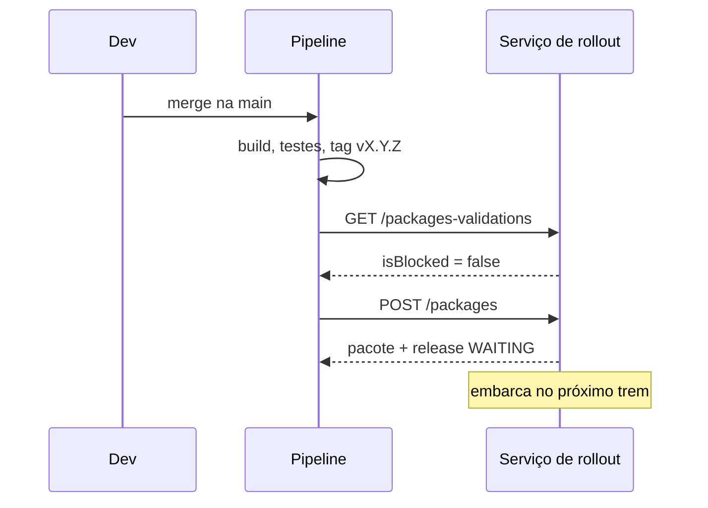

<TechIcon icon="githubactions/githubactions-original" alt="GitHub Actions" size={56} />

O ponto de entrada do processo é o pipeline: depois do merge e do build, ele **publica o pacote**, e o
serviço cria a aplicação (se preciso) e a release `WAITING`.



## Exemplo com GitHub Actions

```yaml title=".github/workflows/release.yml"
name: Publicar pacote
on:
  push:
    tags: ['v*']

jobs:
  publish:
    runs-on: ubuntu-latest
    steps:
      - uses: actions/checkout@v4
      - name: Build e testes
        run: npm ci && npm test && npm run build
      - name: Publicar pacote no serviço de rollout
        env:
          API: ${{ vars.ROLLOUT_API_URL }}
          TOKEN: ${{ secrets.ROLLOUT_API_TOKEN }}
        run: |
          curl -sf -X POST "$API/packages" \
            -H "Authorization: Bearer $TOKEN" \
            -H "correlationID: $(uuidgen)" \
            -H "flowID: github-actions" \
            -H "Content-Type: application/json" \
            -d "{
              \"applicationName\": \"${{ github.event.repository.name }}\",
              \"path\": \".\",
              \"commitSha\": \"${{ github.sha }}\",
              \"pullRequestUrl\": \"${{ github.server_url }}/${{ github.repository }}/commit/${{ github.sha }}\",
              \"story\": \"${{ github.ref_name }}\",
              \"gmud\": \"${{ vars.GMUD_ID }}\"
            }"
```

## Boas práticas

- Token da API em **secret**, nunca no código.
- `curl -f` para o job **falhar** se a API recusar o pacote.
- Publicar só a partir de **tags** ou da `main` protegida.
- Use o mesmo `correlationID` nos logs do pipeline para rastrear a ponta a ponta.
