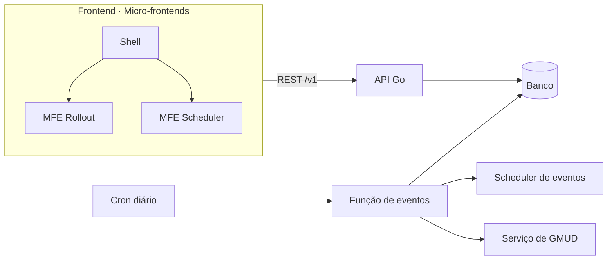

```mermaid
flowchart LR
  subgraph Front[Frontend · Micro-frontends]
    shell[Shell] --> rs[MFE Rollout]
    shell --> sc[MFE Scheduler]
  end
  Front -->|REST /v1| api[API Go]
  api --> db[(Banco)]
  cron[Cron diário] --> fn[Função de eventos]
  fn --> db
  fn --> evt[Scheduler de eventos]
  fn --> gmud[Serviço de GMUD]
```

<DocCardList />
