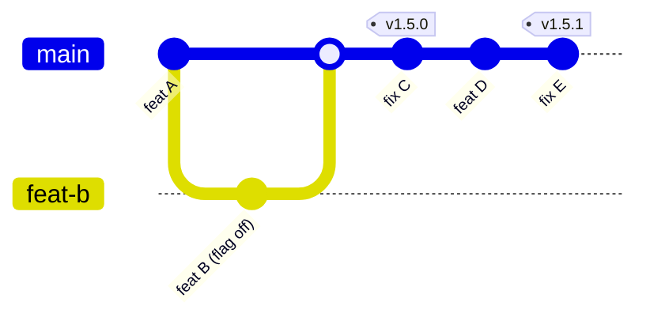

<Badge color="purple">git</Badge>

## Comparativo

| Estratégia | Como funciona | Combina com release train? |
| --- | --- | --- |
| **Trunk-based** | Branches curtas e merge diário na `main`, com features incompletas atrás de flags | **Sim, a melhor opção** |
| **GitHub Flow** | Branch por feature → PR → merge na `main` → deploy | Sim |
| **GitFlow** | `develop`, `release/*`, `hotfix/*`, `main` | Funciona, mas é pesado e gera merges longos |

## Trunk-based + release train

- Cada tag gera um **pacote** que embarca no próximo trem.
- Código incompleto vai para produção **desligado** por feature flag.
- Branches de vida curta (horas ou poucos dias) evitam conflito e "merge hell".

## Regras recomendadas

- `main` sempre **liberável**: CI verde é pré-requisito do merge.
- PR pequeno, com revisão obrigatória.
- Proibir push direto na `main` (branch protection).
