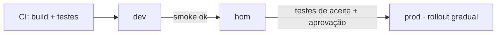

<Badge color="cyan">ambientes</Badge>

## Princípio: build once, deploy many

O **mesmo artefato** (mesmo `commitSha`) é promovido entre ambientes. Só a configuração muda.
Recompilar por ambiente quebra a rastreabilidade.

## Critérios por ambiente

| Ambiente | Objetivo | Critério para promover |
| --- | --- | --- |
| **dev** | Integração contínua | Build e testes unitários verdes |
| **hom** | Validação funcional e de negócio | Testes de integração/E2E, aceite do PO |
| **prod** | Usuário final | GMUD aprovada, checklist [go/no-go](./06-checklist-go-no-go.mdx), embarque no trem |

## Configuração

- Variáveis por ambiente fora do código (secrets manager / variáveis do pipeline).
- Endpoints da API por ambiente: `local`, `dev`, `hom`, `prod` (veja [Convenções](../05-api/01-convencoes.mdx)).
- Feature flags podem ter valores diferentes por ambiente.
