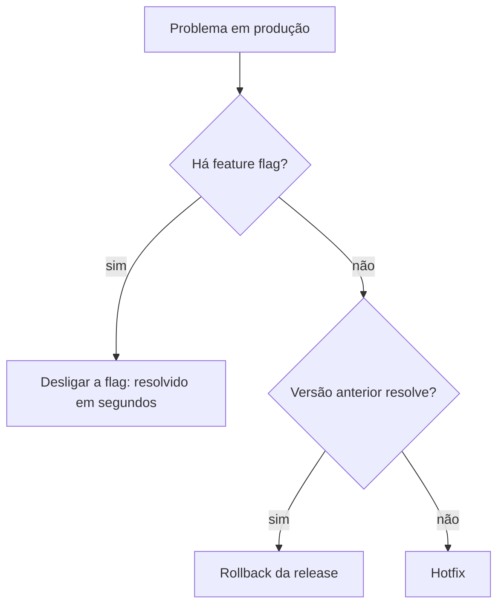

<Badge color="red">urgente</Badge>

## Primeiro: precisa mesmo de hotfix?

## Passo a passo

1. **Contenção**: pause ou faça rollback da release afetada (veja o [runbook](../04-operacao/06-runbook-de-incidente.mdx)).
2. **Correção**: branch a partir da tag em produção (ou da `main`, no trunk-based), com o menor diff possível.
3. **Revisão expressa**: PR com revisão obrigatória, mesmo na urgência.
4. **Novo pacote**: commit novo gera pacote novo. O pacote revertido continua **bloqueado**.
5. **GMUD emergencial**: registro da mudança fora da janela padrão.
6. **Release fora do trem** ou em trem extra, com rollout acelerado e monitoramento reforçado.
7. **Pós-mortem**: registrar causa e ação preventiva.

:::warning
Hotfix não é atalho para pular testes. Rode ao menos os testes automatizados e um smoke test.
:::
