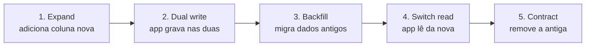

<Badge color="orange">dados</Badge>

Durante um rollout gradual, **versão antiga e nova rodam ao mesmo tempo**. O banco precisa servir as duas,
e o rollback não pode depender de desfazer a migração.

## Expand / Contract

| Fase | Release | Compatível com rollback? |
| --- | --- | --- |
| Expand | Migração aditiva (nova coluna nullable) | Sim |
| Dual write | App v2 grava nas duas colunas | Sim |
| Backfill | Job de migração dos dados | Sim |
| Switch read | App v3 lê da coluna nova | Sim (a antiga ainda existe) |
| Contract | Remove a coluna antiga | **Só depois do rollout em 100%** |

## Regras

- Migrações **aditivas** primeiro; nada de `DROP`/`RENAME` junto com a mudança de código.
- Nunca acople a migração destrutiva ao mesmo pacote que depende dela.
- Migrações versionadas e idempotentes (ex.: golang-migrate, Flyway, Liquibase).

:::danger
`RENAME COLUMN` em produção com rollout gradual quebra a versão antiga na hora.
:::
